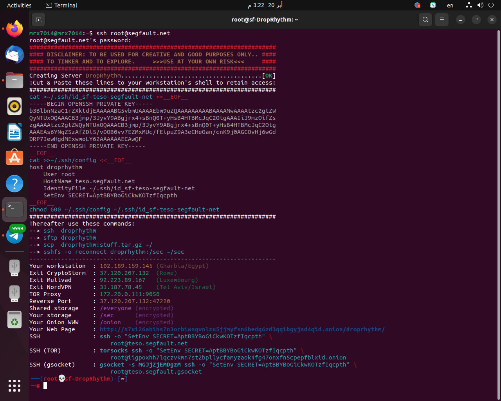
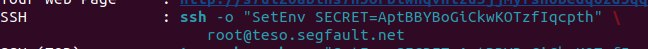
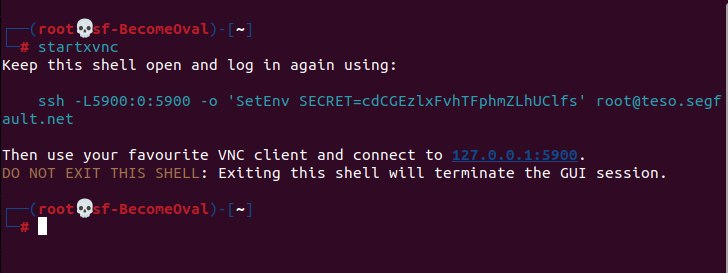
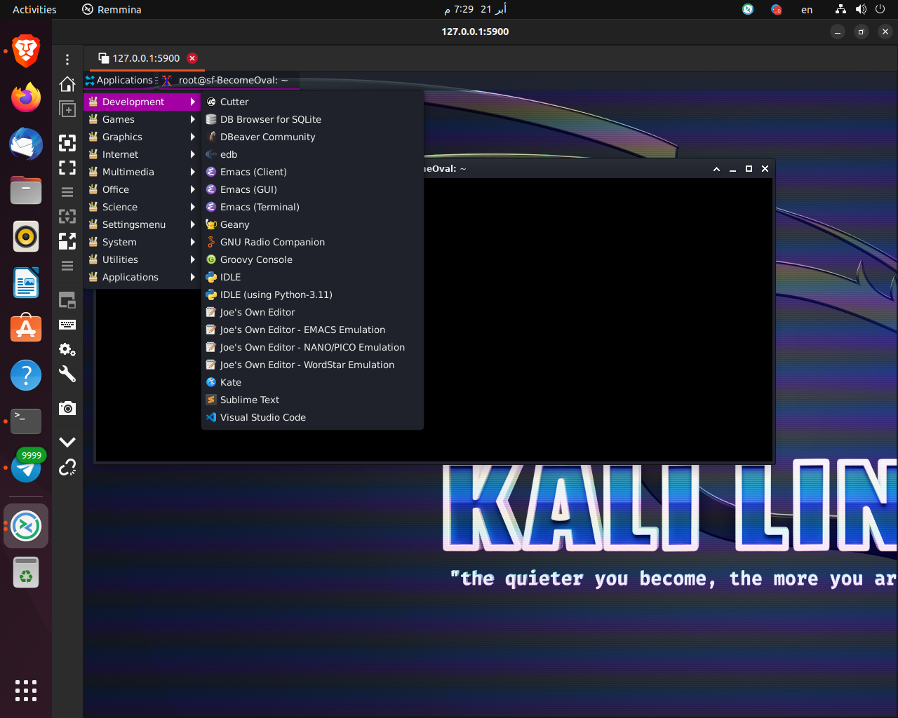

# SSH KaliLinux
A free SSH KaliLinux server without limited time. You can use this for test any tool or using kali linux tools or other something like building custom roms.
____________

- <b>teso is down so change your ssh from root@teso.segfault.net to root@8lgm.segfault.net</b>
____________
All network traffic goes via VPN and is anonymized (e.g. for `reconftw,...etc`). Masscan is allowed using your [own exit node](https://thc.org/segfault/wireguard).
____________
# Server specifications
- RAM : `4GB`
- CPU : `AMD Ryzen 9 7950×3D (32) @ 4.200 GHz`
- GPU : `AMD ATI 0e:00.0 Raphael`
- Hard Size : `16GB`
- 
- If you want to increase this, contact a [SysCop](https://t.me/thcorg) on their Telegram Channel.
____________
# First: Install Packages
____________
- You should use this scripts to install packages to connect to server if you using termux or linux.
____________

- i coded a script for `Linux` and `termux` to install packages and connect to server with very easy way.

- Termux <a href="https://github.com/termux/termux-app/releases">Download it from here</a> For Android.
```sh
curl https://raw.githubusercontent.com/mrx7014/SSH-KaliLinux/main/termux.sh >> termux.sh
bash termux.sh
```

- Linux

```sh
curl https://raw.githubusercontent.com/mrx7014/SSH-KaliLinux/main/linux.sh >> linux.sh
bash linux.sh
```

- Windows

1: Download <a href="https://www.chiark.greenend.org.uk/~sgtatham/putty/latest.html">Putty</a> and choose pkg `32-bit x86`.

2: Open it and type `ssh root@segfault.net` in Hostname Or Ip address bar.

3: The server will ask you password to connect. Type `segfault` and press enter.

4: Now server connected successfully. 

5: Read the [Segfault PuTTY Guide](https://www.thc.org/segfault/faq/putty/).

- You can use https://shell.segfault.net too to connect to server from windows or any other device.
____________

- ios

You can use **ISH (like termux)** to connect to server and use vnc viewer too connect to gui <b>Both are available on the App store</b>

You don't need to install any packages,just connect to server from  ISH App with this command `ssh root@8lgm.segfault.net`.

Download ISH From <a href="https://apps.apple.com/us/app/ish-shell/id1436902243">Here</a>

Download VNC Viewer from <a href="https://apps.apple.com/us/app/vnc-viewer-remote-desktop/id352019548">Here</a>

____________

- Password for connect
```sh
segfault
```
</a>
____________

- You have now successfully connected to your server. Write down the SECRET shown on the screen. You need this SECRET to connect back to YOUR server.
____________
# You should copy this ssh line from ssh -o to segfault.net
- Like This `ssh -o "SetEnv SECRET=PlPtAROaKlMNmnlsMwSbyb" root@8lgm.segfault.net`
- </a>
____________
- You must use this string `ssh -o SetEnv SECRET=...` to connect back to _your_ server. Your data/work is associated with this `SECRET`. You can only access your data if you use the SECRET from the `ssh -o` line. Do not use `ssh root@segfault.net` again.
____________
# Now if you want to connect to server with vnc server follow steps:
- Add `-L5900:0:5900` to your ssh line and connect to your server like this: `ssh -L5900:0:5900 -o 'SetEnv SECRET=...' root@...`.

- Type this command in terminal
```sh 
startxvnc
```
- Then it will look like this:  
</a>
- Then open any vnc viewer. I'm using Remmina who is coming with Linux.

- You can download VNC Viewer for
android from <a href="https://play.google.com/store/apps/details?id=com.realvnc.viewer.android&hl=en_US&pli=1">Here</a>

- For Windows From <a href="https://www.realvnc.com/en/connect/download/viewer/windows/">Here</a>

- For Linux **Remmina** installed already on ubuntu and if it not installed check this website **https://remmina.org/how-to-install-remmina/**

____________

- Then Type this ip in VNC Viewer

```sh
127.0.0.1:5900
```
</a>
- Now you are successfully connected to the server with VNC server,Enjoy it.
____________
# Contact US
- Linktree: https://linktr.ee/mrx7014
____________
# Thanks to 
- [THC](https://www.thc.org) for this free server
- join telegram group https://t.me/thcorg
- Website: https://www.thc.org
